

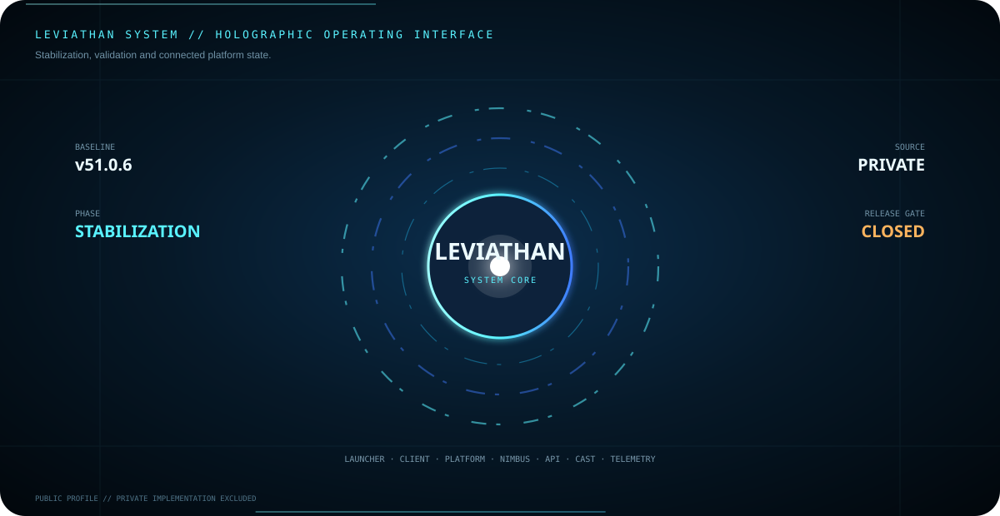

 

<strong>Founder of Leviathan and Nimbus</strong>

 

Building Minecraft software, security systems, APIs, developer tooling and connected gaming platforms.

  

## Leviathan Neural Core

  

A synchronized neural volume with a visible central intelligence core, counter-rotating orbital layers and signal flow aligned to the Leviathan visual system.

## Leviathan Command Core

  

Internal baseline <strong>v51.0.6</strong> • stabilization + validation • no public launcher or installer release

## Identity & External Services


## Leviathan Data Platform


## Development Roadmap

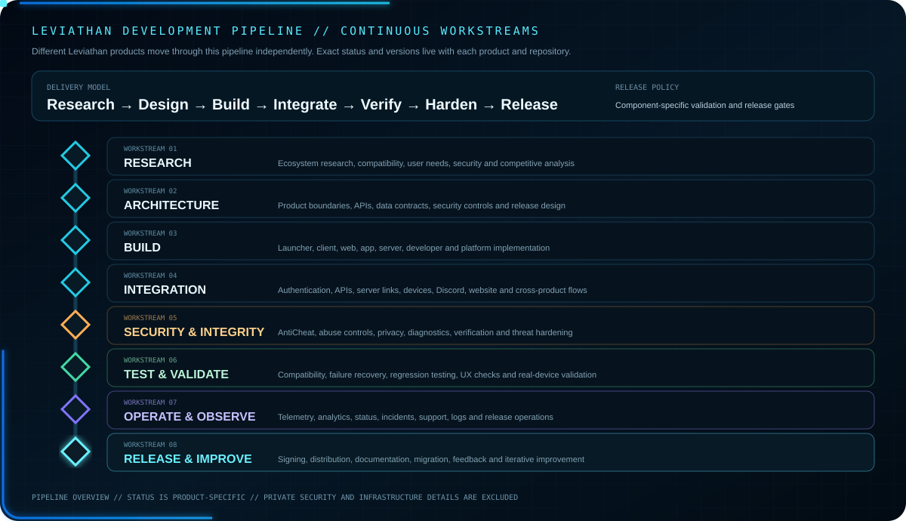

## Core Products


## Current Leviathan Development Stack


## Leviathan Ecosystem


## Platform Areas


## Experience & Commerce Flows


## Public Developer Repositories


## Leviathan Development Activity

<h3 align="center">Live Account Overview</h3>

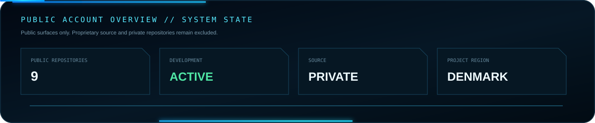

<h3 align="center">Public Commit Activity in the Last Year</h3>

<a href="https://github.com/Lapinite?tab=overview">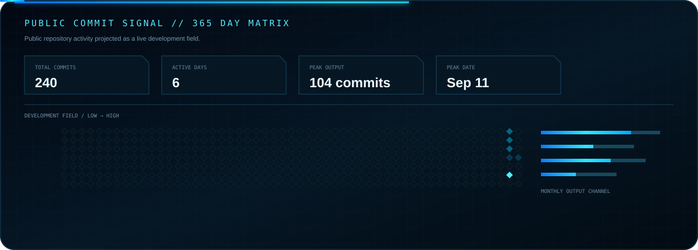</a>

<h3 align="center">Live Public Activity</h3>

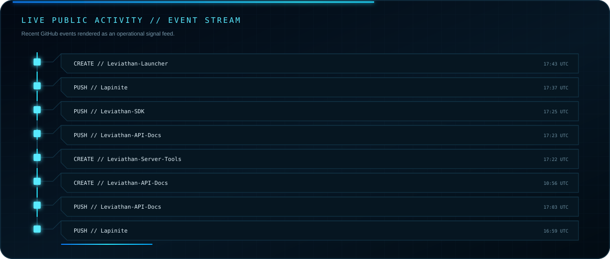

<h3 align="center">Public Repository Health</h3>

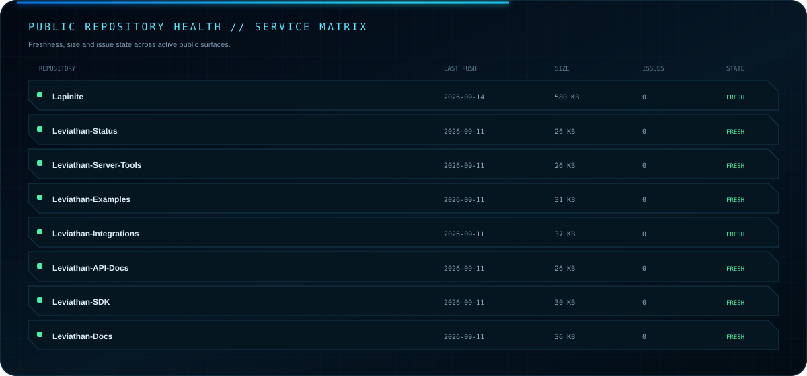

<h3 align="center">Public Development Analytics</h3>

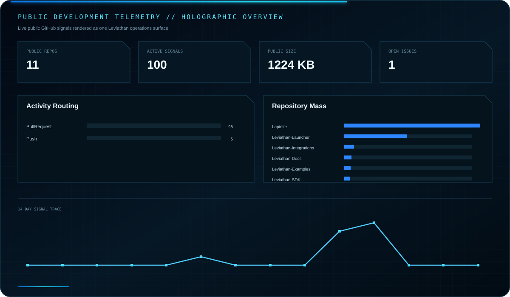

<h3 align="center">Leviathan Launcher</h3>

<a href="https://github.com/Lapinite/Leviathan-Launcher">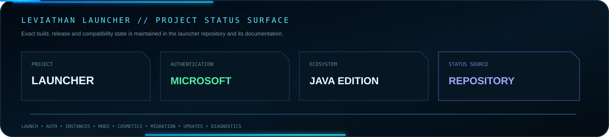</a>

## Contribution Activity

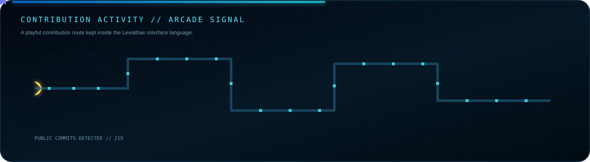

## Developer Resources

<a href="https://github.com/Lapinite/Leviathan-Docs"><strong>Documentation</strong></a> · <a href="https://github.com/Lapinite/Leviathan-API-Docs"><strong>API Reference</strong></a> · <a href="https://github.com/Lapinite/Leviathan-SDK"><strong>SDK</strong></a> · <a href="https://github.com/Lapinite/Leviathan-Examples"><strong>Examples</strong></a> · <a href="https://github.com/Lapinite/Leviathan-Integrations"><strong>Integrations</strong></a> · <a href="https://github.com/Lapinite/Leviathan-Status"><strong>Status</strong></a>

## Connect

   

NOT AN OFFICIAL MINECRAFT PRODUCT. NOT APPROVED BY OR ASSOCIATED WITH MOJANG OR MICROSOFT. © 2026 Leviathan project owner. All Rights Reserved.

