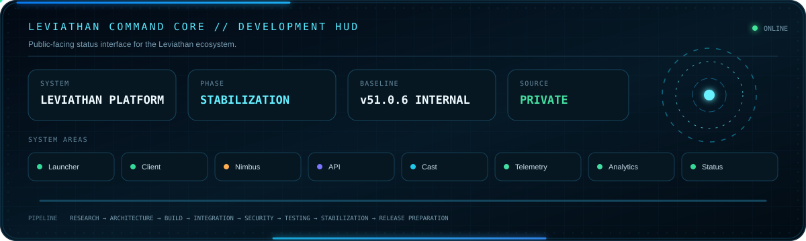
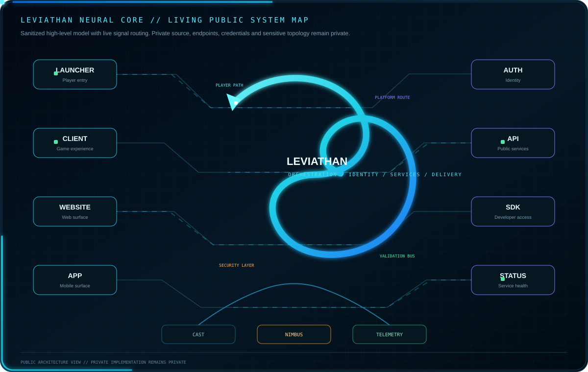

<picture>
  <source media="(prefers-color-scheme: dark)" srcset="./assets/hero-dark.svg">
  <source media="(prefers-color-scheme: light)" srcset="./assets/hero-light.svg">
  
</picture>

 

<strong>Founder of Leviathan and Nimbus</strong>

 

Building Minecraft software, security systems, APIs, developer tooling and connected gaming platforms.

  

## Leviathan Command Core

  

Leviathan is under active internal development. The current internal baseline is **v51.0.6**, with stabilization and validation work in progress. No public launcher or installer release is implied by this profile.

## Leviathan Neural Core

  

The Neural Core is a deliberately simplified public system map. It communicates the product ecosystem without exposing proprietary source code, private endpoints, internal service topology, credentials or sensitive implementation details.

## Development Roadmap

  

The current focus is stabilization, testing and internal release preparation. Public release only happens after the required validation and release gates are complete.

## Core Products

<table width="100%">
<tr>
<td width="50%" valign="top">
<h3 align="center">Leviathan Launcher & Client</h3>

<strong>Minecraft: Java Edition launcher and connected player platform</strong>

Leviathan focuses on legitimate Microsoft authentication, game ownership validation, profiles, instances, customization, updates, connected services and the broader Leviathan player experience.

<a href="https://github.com/Lapinite/Leviathan-Launcher"><strong>Public Repository</strong></a> · <a href="https://github.com/Lapinite/Leviathan-Docs"><strong>Docs</strong></a>

</td>
<td width="50%" valign="top">
<h3 align="center">Nimbus AntiCheat</h3>

<strong>Packet-based Minecraft server security</strong>

Nimbus focuses on packet inspection, movement and combat validation, latency compensation, violation tracking, staff tooling, calibration and false-positive control.

<a href="https://www.spigotmc.org/members/leviathanclient.2607111/"><strong>LeviathanClient on SpigotMC</strong></a>

</td>
</tr>
</table>

## Current Leviathan Development Stack

  

Java 21 · JavaScript · HTML · CSS · PowerShell · Kotlin DSL / Gradle · Windows CMD · Shell · Inno Setup · JSON · YAML · Markdown

High-level technology names only. Proprietary Leviathan source code remains private.

## Platform Areas

<table width="100%">
<tr>
<td width="25%" valign="top"><strong>Player Software</strong> Launcher · Client · Profiles · Instances · Updates · Customization</td>
<td width="25%" valign="top"><strong>Platform</strong> Authentication · APIs · Accounts · Cast · Connected Services</td>
<td width="25%" valign="top"><strong>Protection</strong> Nimbus · Security · Integrity · Abuse Protection · Reliability</td>
<td width="25%" valign="top"><strong>Observability</strong> Telemetry · Analytics · Logging · Monitoring · Status</td>
</tr>
</table>

## Public Developer Repositories

<table width="100%">
<tr>
<td width="50%" valign="top"><strong><a href="https://github.com/Lapinite/Leviathan-Launcher">Leviathan-Launcher</a></strong> Public launcher repository, documentation, policies, roadmap and release-facing project information.</td>
<td width="50%" valign="top"><strong><a href="https://github.com/Lapinite/Leviathan-Docs">Leviathan-Docs</a></strong> Official documentation for the Leviathan ecosystem.</td>
</tr>
<tr>
<td width="50%" valign="top"><strong><a href="https://github.com/Lapinite/Leviathan-API-Docs">Leviathan-API-Docs</a></strong> Public API references and integration documentation.</td>
<td width="50%" valign="top"><strong><a href="https://github.com/Lapinite/Leviathan-SDK">Leviathan-SDK</a></strong> Developer SDK for supported public integrations.</td>
</tr>
<tr>
<td width="50%" valign="top"><strong><a href="https://github.com/Lapinite/Leviathan-Integrations">Leviathan-Integrations</a></strong> Supported integration patterns, plugins and webhooks.</td>
<td width="50%" valign="top"><strong><a href="https://github.com/Lapinite/Leviathan-Examples">Leviathan-Examples</a></strong> Example projects for public SDKs, APIs and integrations.</td>
</tr>
<tr>
<td width="50%" valign="top"><strong><a href="https://github.com/Lapinite/Leviathan-Server-Tools">Leviathan-Server-Tools</a></strong> Minecraft server tools and utilities intended for public use.</td>
<td width="50%" valign="top"><strong><a href="https://github.com/Lapinite/Leviathan-Status">Leviathan-Status</a></strong> Public service status and incident visibility.</td>
</tr>
</table>

<a href="https://github.com/Lapinite?tab=repositories"><strong>Browse all repositories</strong></a>

## Leviathan Development Activity

<h3 align="center">Live Account Overview</h3>

<!-- PROFILE_SUMMARY_START -->

  
  
  
  

<!-- PROFILE_SUMMARY_END -->

<!-- REPOSITORY_AGGREGATES_START -->

  

<!-- REPOSITORY_AGGREGATES_END -->

<h3 align="center">Public Commit Activity in the Last Year</h3>

  

<h3 align="center">Recent Public Activity</h3>

<!-- RECENT_ACTIVITY_START -->
<table align="center" width="100%">
<tr><th align="left">Activity</th><th align="right">When</th></tr>
<tr><td><a href="https://github.com/Lapinite/Lapinite">Merged pull request #5 in Lapinite/Lapinite</a></td><td align="right">2026-09-11 16:01 UTC</td></tr>
<tr><td><a href="https://github.com/Lapinite/Lapinite">Opened pull request #5 in Lapinite/Lapinite</a></td><td align="right">2026-09-11 16:01 UTC</td></tr>
<tr><td><a href="https://github.com/Lapinite/Lapinite/commits/feat/profile-visuals-v3">Pushed updates to Lapinite/Lapinite (feat/profile-visuals-v3)</a></td><td align="right">2026-09-11 16:01 UTC</td></tr>
<tr><td><a href="https://github.com/Lapinite/Lapinite">Created branch feat/profile-visuals-v3 in Lapinite/Lapinite</a></td><td align="right">2026-09-11 15:57 UTC</td></tr>
<tr><td><a href="https://github.com/Lapinite/Lapinite">Merged pull request #4 in Lapinite/Lapinite</a></td><td align="right">2026-09-11 15:50 UTC</td></tr>
<tr><td><a href="https://github.com/Lapinite/Lapinite/commits/main">Pushed updates to Lapinite/Lapinite (main)</a></td><td align="right">2026-09-11 15:50 UTC</td></tr>
<tr><td><a href="https://github.com/Lapinite/Lapinite">Opened pull request #4 in Lapinite/Lapinite</a></td><td align="right">2026-09-11 15:49 UTC</td></tr>
<tr><td><a href="https://github.com/Lapinite/Lapinite/commits/feat/leviathan-profile-v2">Pushed updates to Lapinite/Lapinite (feat/leviathan-profile-v2)</a></td><td align="right">2026-09-11 15:48 UTC</td></tr>
</table>
<!-- RECENT_ACTIVITY_END -->

<h3 align="center">Repository Freshness</h3>

<!-- REPOSITORY_FRESHNESS_START -->
<table align="center" width="100%">
<tr><th align="left">Repository</th><th align="left">Last Push</th><th align="right">Size</th><th align="right">Stars</th><th align="right">Forks</th><th align="right">Open Issues</th></tr>
<tr><td><a href="https://github.com/Lapinite/Lapinite">Lapinite</a></td><td>2026-09-11</td><td align="right">175 KB</td><td align="right">0</td><td align="right">0</td><td align="right">0</td></tr>
<tr><td><a href="https://github.com/Lapinite/Leviathan-Status">Leviathan-Status</a></td><td>2026-09-11</td><td align="right">5 KB</td><td align="right">0</td><td align="right">0</td><td align="right">0</td></tr>
<tr><td><a href="https://github.com/Lapinite/Leviathan-Server-Tools">Leviathan-Server-Tools</a></td><td>2026-09-11</td><td align="right">5 KB</td><td align="right">0</td><td align="right">0</td><td align="right">0</td></tr>
<tr><td><a href="https://github.com/Lapinite/Leviathan-Examples">Leviathan-Examples</a></td><td>2026-09-11</td><td align="right">9 KB</td><td align="right">0</td><td align="right">0</td><td align="right">0</td></tr>
<tr><td><a href="https://github.com/Lapinite/Leviathan-Integrations">Leviathan-Integrations</a></td><td>2026-09-11</td><td align="right">9 KB</td><td align="right">0</td><td align="right">0</td><td align="right">0</td></tr>
<tr><td><a href="https://github.com/Lapinite/Leviathan-SDK">Leviathan-SDK</a></td><td>2026-09-11</td><td align="right">9 KB</td><td align="right">0</td><td align="right">0</td><td align="right">0</td></tr>
<tr><td><a href="https://github.com/Lapinite/Leviathan-API-Docs">Leviathan-API-Docs</a></td><td>2026-09-11</td><td align="right">7 KB</td><td align="right">0</td><td align="right">0</td><td align="right">0</td></tr>
</table>
<!-- REPOSITORY_FRESHNESS_END -->

<!-- PUBLIC_ANALYTICS_START -->
<h3 align="center">Public Development Analytics</h3>

<table align="center" width="100%">
<tr>
<td width="50%" valign="top"></td>
<td width="50%" valign="top"></td>
</tr>
<tr>
<td width="50%" valign="top"></td>
<td width="50%" valign="top"></td>
</tr>
</table>

<!-- PUBLIC_ANALYTICS_END -->

<h3 align="center">Leviathan Launcher</h3>

  
  
  
  

## Contribution Activity

  

## Developer Resources

<a href="https://github.com/Lapinite/Leviathan-Docs"><strong>Documentation</strong></a> ·
<a href="https://github.com/Lapinite/Leviathan-API-Docs"><strong>API Reference</strong></a> ·
<a href="https://github.com/Lapinite/Leviathan-SDK"><strong>SDK</strong></a> ·
<a href="https://github.com/Lapinite/Leviathan-Examples"><strong>Examples</strong></a> ·
<a href="https://github.com/Lapinite/Leviathan-Integrations"><strong>Integrations</strong></a> ·
<a href="https://github.com/Lapinite/Leviathan-Status"><strong>Status</strong></a>

## Connect

<a href="https://www.spigotmc.org/members/leviathanclient.2607111/">SpigotMC</a> ·
<a href="https://github.com/Lapinite/Leviathan-Launcher/blob/main/SECURITY.md">Security</a> ·
<a href="https://github.com/Lapinite/Leviathan-Launcher/blob/main/SUPPORT.md">Support</a> ·
<a href="https://github.com/Lapinite/Leviathan-Launcher/blob/main/LEGAL.md">Legal</a>

NOT AN OFFICIAL MINECRAFT PRODUCT. NOT APPROVED BY OR ASSOCIATED WITH MOJANG OR MICROSOFT.

 

© 2026 Leviathan project owner. All Rights Reserved.

