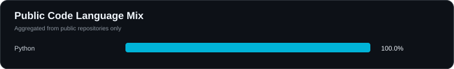
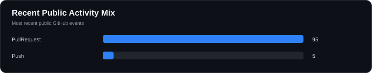
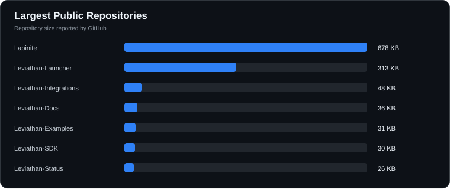
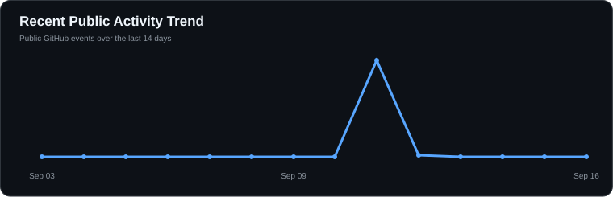

<div align="center">

<picture>
  <source media="(prefers-color-scheme: dark)" srcset="./assets/hero-dark.svg">
  <source media="(prefers-color-scheme: light)" srcset="./assets/hero-light.svg">
  
</picture>

<br>

<strong>Founder of Leviathan and Nimbus</strong>

<br>

Building Minecraft launchers, client systems, server tools, security systems, APIs, developer tooling and connected gaming platforms.

<br><br>

<a href="https://github.com/Lapinite"></a>
&nbsp;&nbsp;
<a href="https://discord.gg/f75VJjPea"></a>
&nbsp;&nbsp;
<a href="https://youtube.com/@leviathanclient"></a>
&nbsp;&nbsp;
<a href="https://instagram.com/leviathanclient"></a>
&nbsp;&nbsp;
<a href="https://x.com/leviathanrealm"></a>
&nbsp;&nbsp;
<a href="https://twitch.tv/leviathanclient"></a>
&nbsp;&nbsp;
<a href="https://bsky.app/profile/leviathanclient.bsky.social"></a>

<br><br>

<a href="https://github.com/Lapinite/Leviathan-Launcher"></a>
<a href="https://github.com/Lapinite/Leviathan-Docs"></a>
<a href="https://github.com/Lapinite?tab=projects"></a>
<a href="https://github.com/Lapinite?tab=stars"></a>
<a href="https://www.spigotmc.org/members/leviathanclient.2607111/"></a>


</div>

---

<h2 align="center">Leviathan Ecosystem</h2>

<p align="center">
Leviathan is being built as a multi-repository Minecraft platform rather than a single launcher. The ecosystem spans player software, authentication, backend services, APIs, developer tooling, social systems, creator systems, server infrastructure, security, research, release engineering and community growth.
</p>

<table align="center" width="100%">
<tr>
<td width="25%" valign="top" align="center">
<h3>Player Software</h3>
<sub>Desktop launcher · client systems · game installs · instances · profiles · accounts · customization · updates</sub>
</td>
<td width="25%" valign="top" align="center">
<h3>Platform</h3>
<sub>Identity · accounts · social · creators · cosmetics · economy · marketplace · APIs · connected services</sub>
</td>
<td width="25%" valign="top" align="center">
<h3>Developers</h3>
<sub>Documentation · SDKs · API references · examples · integrations · plugins · webhooks · developer tools</sub>
</td>
<td width="25%" valign="top" align="center">
<h3>Servers & Security</h3>
<sub>Minecraft server tools · Nimbus AntiCheat · moderation · telemetry · abuse protection · reliability</sub>
</td>
</tr>
</table>

<br>

```text
Leviathan Ecosystem
│
├── Player Software
│   ├── Desktop Launcher
│   ├── Minecraft Client Systems
│   ├── Installation & Instance Management
│   ├── Profiles & Accounts
│   ├── Customization
│   └── Release & Update Channels
│
├── Identity & Platform
│   ├── Microsoft Authentication
│   ├── Minecraft & Xbox Services
│   ├── Account Linking
│   ├── Sessions & Device Trust
│   ├── Social & Player Systems
│   ├── Creator Platform
│   ├── Cosmetics & Economy
│   └── Marketplace Systems
│
├── Backend & Data
│   ├── Platform Services
│   ├── REST APIs
│   ├── Databases
│   ├── Telemetry & Analytics
│   ├── Logging & Monitoring
│   ├── Webhooks
│   └── Service Integrations
│
├── Developer Ecosystem
│   ├── Documentation
│   ├── API Documentation
│   ├── SDKs
│   ├── Example Projects
│   ├── Integrations
│   └── Developer Tooling
│
├── Minecraft Server Ecosystem
│   ├── Server Tools
│   ├── Plugins & Utilities
│   ├── Staff & Moderation Systems
│   └── Nimbus AntiCheat
│
├── Research & Intelligence
│   ├── Competitive Research
│   ├── Minecraft Launchers & Clients
│   ├── Modding Platforms
│   ├── Server Software & Plugins
│   ├── Security & Anti-Cheat
│   ├── Backend & Infrastructure
│   ├── Data & Analytics
│   ├── Performance & Optimization
│   ├── Growth & Marketing
│   └── Crawling & Archiving
│
└── Infrastructure & Security
    ├── CI/CD
    ├── Release Engineering
    ├── Update Infrastructure
    ├── Integrity Verification
    ├── Security & Recovery
    ├── Abuse Protection
    ├── Observability
    └── Service Status
```

---

<h2 align="center">Core Products</h2>

<table align="center" width="100%">
<tr>
<td width="50%" valign="top">

<h3 align="center">Leviathan Launcher & Client</h3>

<p align="center"><strong>Minecraft: Java Edition desktop launcher and connected player platform</strong></p>

Leviathan Launcher is a third-party Minecraft: Java Edition desktop launcher for legitimate game owners. It focuses on Microsoft authentication, game ownership verification, profiles, instances, customization, cosmetics, updates and integration with the broader Leviathan platform.

<p align="center">
  <a href="https://github.com/Lapinite/Leviathan-Launcher/commits/main"></a>
  <a href="https://github.com/Lapinite/Leviathan-Launcher"></a>
  <a href="https://github.com/Lapinite/Leviathan-Launcher"></a>
</p>

<p align="center">
<a href="https://github.com/Lapinite/Leviathan-Launcher"><strong>Repository</strong></a>
&nbsp;|&nbsp;
<a href="https://github.com/Lapinite/Leviathan-Docs"><strong>Documentation</strong></a>
&nbsp;|&nbsp;
<a href="https://github.com/Lapinite?tab=projects"><strong>Projects</strong></a>
&nbsp;•&nbsp;
<a href="https://github.com/Lapinite?tab=stars"><strong>Research Lists</strong></a>
</p>

</td>
<td width="50%" valign="top">

<h3 align="center">Nimbus AntiCheat</h3>

<p align="center"><strong>Packet-based Minecraft server AntiCheat</strong></p>

Nimbus is the AntiCheat and server security branch of the ecosystem. It focuses on packet inspection, movement prediction, combat validation, world and inventory checks, latency compensation, violation tracking, staff tooling, calibration and false-positive control.

<p align="center">
  
  
</p>

<p align="center">
<a href="https://www.spigotmc.org/members/leviathanclient.2607111/"><strong>LeviathanClient on SpigotMC</strong></a>
&nbsp;|&nbsp;
<a href="https://github.com/Lapinite?tab=projects"><strong>Project Tracking</strong></a>
</p>

<p align="center"><sub>The Nimbus SpigotMC resource is currently being transferred to the LeviathanClient profile. The direct resource link and live resource badges will be restored after the migration is complete.</sub></p>

</td>
</tr>
</table>

---

<h2 align="center">Public Developer Repositories</h2>

<p align="center">
The public repository structure separates the launcher, documentation, APIs, SDKs, examples, integrations, server tooling and operational status into dedicated areas.
</p>

<table align="center" width="100%">
<tr>
<td width="50%" valign="top">
<h3><a href="https://github.com/Lapinite/Leviathan-Launcher">Leviathan-Launcher</a></h3>
Primary public launcher repository for the current Leviathan desktop player experience, Microsoft authentication, profiles, customization and launcher systems.
</td>
<td width="50%" valign="top">
<h3><a href="https://github.com/Lapinite/Leviathan-Docs">Leviathan-Docs</a></h3>
Official documentation for the Leviathan ecosystem, including launcher, client, server products, APIs, integrations and developer tools.
</td>
</tr>
<tr>
<td width="50%" valign="top">
<h3><a href="https://github.com/Lapinite/Leviathan-API-Docs">Leviathan-API-Docs</a></h3>
Developer documentation and API reference for public Leviathan services, endpoints, authentication and integrations.
</td>
<td width="50%" valign="top">
<h3><a href="https://github.com/Lapinite/Leviathan-SDK">Leviathan-SDK</a></h3>
Official SDK for integrating applications, plugins and services with the Leviathan platform and APIs.
</td>
</tr>
<tr>
<td width="50%" valign="top">
<h3><a href="https://github.com/Lapinite/Leviathan-Integrations">Leviathan-Integrations</a></h3>
Official integrations for Minecraft plugins, Discord, webhooks and supported third-party platforms.
</td>
<td width="50%" valign="top">
<h3><a href="https://github.com/Lapinite/Leviathan-Examples">Leviathan-Examples</a></h3>
Example projects demonstrating supported Leviathan APIs, SDKs, plugins, webhooks and integration patterns.
</td>
</tr>
<tr>
<td width="50%" valign="top">
<h3><a href="https://github.com/Lapinite/Leviathan-Server-Tools">Leviathan-Server-Tools</a></h3>
Public collection and directory for Minecraft server tools, plugins and utilities developed for the ecosystem.
</td>
<td width="50%" valign="top">
<h3><a href="https://github.com/Lapinite/Leviathan-Status">Leviathan-Status</a></h3>
Public service status, availability information and incident history for Leviathan platform services.
</td>
</tr>
</table>

<p align="center"><a href="https://github.com/Lapinite?tab=repositories"><strong>View all repositories →</strong></a></p>

---

<h2 align="center">GitHub Projects & Delivery</h2>

<p align="center">
Development is coordinated through dedicated GitHub Project boards that separate product delivery, infrastructure, security, research, growth and release work. The boards are currently private, while public repositories and documentation expose the parts intended for the community.
</p>

<p align="center"><a href="https://github.com/Lapinite?tab=projects"><strong>Open GitHub Projects →</strong></a></p>

<table align="center" width="100%">
<tr>
<td width="50%" valign="top">
<h3>Leviathan - Master Roadmap</h3>
<sub>Cross-project milestones · priorities · dependencies · platform sequencing · major product phases · long-term roadmap coordination</sub>
</td>
<td width="50%" valign="top">
<h3>Leviathan - Launcher & Client</h3>
<sub>Desktop launcher · client systems · profiles · instances · authentication · game management · customization · updates · player experience</sub>
</td>
</tr>
<tr>
<td width="50%" valign="top">
<h3>Leviathan - Web, API & Infrastructure</h3>
<sub>Website · backend services · REST APIs · databases · authentication services · cloud infrastructure · CDN · observability · platform operations</sub>
</td>
<td width="50%" valign="top">
<h3>Leviathan - Discord & Automation</h3>
<sub>Discord bots · community automation · research automation · webhooks · platform integrations · moderation workflows · operational tooling</sub>
</td>
</tr>
<tr>
<td width="50%" valign="top">
<h3>Nimbus - Security & Anti-Cheat</h3>
<sub>Packet analysis · movement prediction · combat validation · security research · false-positive control · testing · enforcement · staff tooling</sub>
</td>
<td width="50%" valign="top">
<h3>Leviathan - Research & Intelligence</h3>
<sub>Competitive research · Minecraft ecosystem research · platform research · developer resources · source collection · technical intelligence · product discovery</sub>
</td>
</tr>
<tr>
<td width="50%" valign="top">
<h3>Leviathan - Growth, Brand & Community</h3>
<sub>Branding · social media · content · creators · influencers · advertising · acquisition · referrals · retention · community growth · marketing operations</sub>
</td>
<td width="50%" valign="top">
<h3>Leviathan - Release & QA</h3>
<sub>Regression testing · smoke testing · release gates · packaging · validation · changelogs · rollout planning · update channels · release confidence</sub>
</td>
</tr>
</table>

---

<h2 align="center">Engineering Focus</h2>

<table align="center" width="100%">
<tr>
<td width="25%" valign="top">
<h3 align="center">Launcher & Client</h3>
<p align="center"><sub>Desktop launcher · game management · instances · profiles · installation · version management · customization · client systems · update channels</sub></p>
</td>
<td width="25%" valign="top">
<h3 align="center">Identity & Security</h3>
<p align="center"><sub>Microsoft Identity · OAuth · PKCE · Minecraft Services · Xbox Services · account linking · sessions · device trust · recovery · abuse protection</sub></p>
</td>
<td width="25%" valign="top">
<h3 align="center">Platform & APIs</h3>
<p align="center"><sub>Backend services · REST APIs · account systems · social systems · creator systems · cosmetics · economy · marketplace · webhooks</sub></p>
</td>
<td width="25%" valign="top">
<h3 align="center">Developer Experience</h3>
<p align="center"><sub>SDKs · API documentation · examples · integrations · configuration · libraries · tooling · developer workflows</sub></p>
</td>
</tr>
<tr>
<td width="25%" valign="top">
<h3 align="center">Minecraft & Server</h3>
<p align="center"><sub>Java 21 · Paper · Bukkit · SpigotMC · PacketEvents · Citizens · PlaceholderAPI · LiteBans · plugin messaging · server automation</sub></p>
</td>
<td width="25%" valign="top">
<h3 align="center">AntiCheat</h3>
<p align="center"><sub>Packet inspection · movement prediction · combat validation · violation tracking · latency compensation · TPS awareness · calibration</sub></p>
</td>
<td width="25%" valign="top">
<h3 align="center">Data & Observability</h3>
<p align="center"><sub>MySQL · telemetry · analytics · metrics · logging · monitoring · dashboards · health checks · service status · incident visibility</sub></p>
</td>
<td width="25%" valign="top">
<h3 align="center">Release & Infrastructure</h3>
<p align="center"><sub>GitHub Actions · Maven · testing · build automation · manifests · integrity verification · distribution · CDN delivery · release engineering</sub></p>
</td>
</tr>
</table>

---

<h2 align="center">Platform Areas</h2>

<table align="center" width="100%">
<tr>
<td width="33%" valign="top" align="center">
<h3>Accounts & Identity</h3>
<sub>Microsoft OAuth + PKCE<br>Minecraft ownership<br>Xbox services<br>Account linking<br>Sessions<br>Device trust<br>Recovery</sub>
</td>
<td width="33%" valign="top" align="center">
<h3>Social & Community</h3>
<sub>Player profiles<br>Friends & social systems<br>Discord integration<br>Creator discovery<br>Community tooling<br>Notifications<br>Connected services</sub>
</td>
<td width="33%" valign="top" align="center">
<h3>Creator & Marketplace</h3>
<sub>Creator systems<br>Cosmetics<br>Digital inventory<br>Economy systems<br>Marketplace infrastructure<br>Commerce integrations<br>Content discovery</sub>
</td>
</tr>
<tr>
<td width="33%" valign="top" align="center">
<h3>Security</h3>
<sub>Authentication security<br>Session protection<br>Rate limiting<br>CSP<br>Integrity verification<br>Abuse prevention<br>Recovery systems</sub>
</td>
<td width="33%" valign="top" align="center">
<h3>Analytics & Growth</h3>
<sub>Telemetry<br>Product analytics<br>User acquisition<br>Conversion<br>Retention<br>Referrals<br>Community growth</sub>
</td>
<td width="33%" valign="top" align="center">
<h3>Operations</h3>
<sub>CI/CD<br>Release channels<br>Monitoring<br>Logging<br>Status systems<br>Configuration<br>Developer workflows</sub>
</td>
</tr>
</table>

---

<h2 align="center">Research & Intelligence</h2>

<p align="center">
Research is treated as part of the Leviathan engineering, product and security process. Public GitHub research lists organize selected projects, technologies, platforms, developer tools, infrastructure, security references and competitive material across Minecraft and the wider software ecosystem.
</p>

<p align="center">
<a href="https://github.com/Lapinite?tab=stars"><strong>Browse the public GitHub research library →</strong></a>
</p>

<table align="center" width="100%">
<tr>
<td width="33%" valign="top" align="center">
<h3>Minecraft Research</h3>
<sub>Launchers · clients · modding platforms · loaders · servers · plugins · performance · cosmetics · game content</sub>
</td>
<td width="33%" valign="top" align="center">
<h3>Engineering Research</h3>
<sub>Backend · APIs · authentication · telemetry · CI/CD · developer tools · crawlers · infrastructure · security</sub>
</td>
<td width="33%" valign="top" align="center">
<h3>Product & Growth Research</h3>
<sub>Competitive analysis · ecommerce · payments · marketing · acquisition · creators · community · UI · design systems</sub>
</td>
</tr>
</table>

<br>

<h3 align="center">Public GitHub Research Lists</h3>

<table align="center" width="100%">
<tr>
<td width="50%" valign="top">

### [Minecraft Launchers & Clients](https://github.com/stars/Lapinite/lists/minecraft-launchers-clients)

Minecraft launchers, clients, instance managers, account systems, mod loaders, client architecture, update systems and related projects researched for Leviathan.

</td>
<td width="50%" valign="top">

### [Leviathan Competitive Research](https://github.com/stars/Lapinite/lists/leviathan-competitive-research)

Launchers, clients, platforms and products studied for product, UX, architecture and feature comparison.

</td>
</tr>
<tr>
<td width="50%" valign="top">

### [Minecraft Modding & Platforms](https://github.com/stars/Lapinite/lists/minecraft-modding-platforms)

Fabric, Legacy Fabric, Forge, NeoForge, Modrinth, CurseForge, mappings, loaders, modding APIs and compatibility tooling.

</td>
<td width="50%" valign="top">

### [Minecraft Servers & Plugins](https://github.com/stars/Lapinite/lists/minecraft-servers-plugins)

Minecraft server software, Paper, Spigot, Velocity, proxies, plugins, server tooling and infrastructure.

</td>
</tr>
<tr>
<td width="50%" valign="top">

### [Security & Anti-Cheat](https://github.com/stars/Lapinite/lists/security-anti-cheat)

Application security, Minecraft anti-cheat, authentication security, exploit prevention, hardening and defensive security research.

</td>
<td width="50%" valign="top">

### [Performance & Optimization](https://github.com/stars/Lapinite/lists/performance-optimization)

Java performance, rendering, networking, memory optimization, profiling and Minecraft performance projects.

</td>
</tr>
<tr>
<td width="50%" valign="top">

### [Backend, APIs & Auth](https://github.com/stars/Lapinite/lists/backend-apis-auth)

Backend architecture, APIs, authentication, authorization, account systems, databases, caching and platform infrastructure.

</td>
<td width="50%" valign="top">

### [Data, Analytics & Telemetry](https://github.com/stars/Lapinite/lists/data-analytics-telemetry)

Analytics, telemetry, event pipelines, observability, logging, monitoring, dashboards, experimentation and data infrastructure.

</td>
</tr>
<tr>
<td width="50%" valign="top">

### [Web, UI & Design Systems](https://github.com/stars/Lapinite/lists/web-ui-design-systems)

Frontend frameworks, websites, dashboards, launcher interfaces, design systems, animations and UI inspiration.

</td>
<td width="50%" valign="top">

### [Discord & Community Tools](https://github.com/stars/Lapinite/lists/discord-community-tools)

Discord bots, moderation systems, APIs, webhooks, community automation, integrations and community-management tooling.

</td>
</tr>
<tr>
<td width="50%" valign="top">

### [CI-CD & Release Engineering](https://github.com/stars/Lapinite/lists/ci-cd-release-engineering)

GitHub Actions, build systems, installers, packaging, code signing, releases, auto-updates and deployment tooling.

</td>
<td width="50%" valign="top">

### [Research, Crawlers & Archiving](https://github.com/stars/Lapinite/lists/research-crawlers-archiving)

Crawlers, scrapers, downloaders, indexing, search, media archiving, metadata collection and large-scale research systems.

</td>
</tr>
<tr>
<td width="50%" valign="top">

### [Cosmetics & Game Content](https://github.com/stars/Lapinite/lists/cosmetics-game-content)

Cosmetic systems, skins, capes, emotes, 3D models, animation systems and Minecraft content tooling.

</td>
<td width="50%" valign="top">

### [Ecommerce & Payments](https://github.com/stars/Lapinite/lists/ecommerce-payments)

Storefronts, checkout systems, subscriptions, licensing, entitlements and digital product infrastructure.

</td>
</tr>
<tr>
<td colspan="2" valign="top" align="center">

### [Marketing & Growth](https://github.com/stars/Lapinite/lists/marketing-growth)

Growth tooling, attribution, referrals, social publishing, creator programs, SEO and user acquisition infrastructure.

</td>
</tr>
</table>

<p align="center">
<sub>Public research lists are curated references for study and comparison. Inclusion does not imply affiliation, endorsement, dependency or use within Leviathan.</sub>
</p>

---

<h2 align="center">Security & Reliability</h2>

<table align="center" width="100%">
<tr>
<td width="33%" valign="top">
<h3>Application Security</h3>
<ul>
<li>OAuth with PKCE</li>
<li>Account and session protection</li>
<li>Input validation</li>
<li>Content Security Policy</li>
<li>Rate limiting</li>
<li>Abuse protection</li>
<li>Integrity verification</li>
<li>Dependency awareness</li>
</ul>
</td>
<td width="33%" valign="top">
<h3>Platform Reliability</h3>
<ul>
<li>Health checks</li>
<li>Logging</li>
<li>Metrics</li>
<li>Monitoring</li>
<li>Service status</li>
<li>Incident visibility</li>
<li>Regression testing</li>
<li>Release validation</li>
</ul>
</td>
<td width="33%" valign="top">
<h3>Minecraft Security</h3>
<ul>
<li>Packet analysis</li>
<li>Movement validation</li>
<li>Combat validation</li>
<li>Violation tracking</li>
<li>Lag compensation</li>
<li>False-positive control</li>
<li>Staff alerts</li>
<li>Server-side enforcement</li>
</ul>
</td>
</tr>
</table>

---

<h2 align="center">Technology</h2>

<table align="center" width="100%">
<tr>
<td width="50%" valign="top">
<h3 align="center">Current Leviathan Development Stack</h3>
<p align="center"></p>
<p align="center"><sub>Java 21 · JavaScript · HTML · CSS · PowerShell · Kotlin DSL / Gradle · Windows CMD · Shell · Inno Setup · JSON · YAML · Markdown</sub></p>
<p align="center"><sub>High-level technology names only. Proprietary Leviathan source code remains private.</sub></p>
</td>
<td width="50%" valign="top">
<h3 align="center">Frontend & Web</h3>
<p align="center"></p>
<p align="center"><sub>React · JavaScript · HTML · CSS · responsive interfaces · Fetch API · Progressive Web Apps · Service Workers · localStorage</sub></p>
</td>
</tr>
<tr>
<td width="50%" valign="top">
<h3 align="center">Backend & Data</h3>
<p align="center"></p>
<p align="center"><sub>Java services · Node.js · FastAPI · REST APIs · MySQL · account services · JSON APIs · service integrations</sub></p>
</td>
<td width="50%" valign="top">
<h3 align="center">Cloud & Workflow</h3>
<p align="center"></p>
<p align="center"><sub>Azure · Cloudflare · Git · GitHub · GitHub Actions · GitLab · Maven · Sentry · Windows · PowerShell · CMD · ProGuard</sub></p>
</td>
</tr>
<tr>
<td width="50%" valign="top">
<h3 align="center">Minecraft & Security</h3>
<p align="center">
  
  
  
  
  
</p>
<p align="center"><sub>Paper · Bukkit · SpigotMC · PacketEvents · Citizens · PlaceholderAPI · LiteBans · Microsoft Identity · Minecraft Services · Xbox Services</sub></p>
</td>
<td width="50%" valign="top">
<h3 align="center">Testing, Integration & Creative</h3>
<p align="center"></p>
<p align="center"><sub>JUnit 5 · regression testing · smoke testing · configuration validation · Discord · webhooks · Blender · Photoshop · Illustrator · After Effects · Canva · UI/UX</sub></p>
</td>
</tr>
</table>

---

<h2 align="center">Developer Resources</h2>

<p align="center">
<a href="https://github.com/Lapinite/Leviathan-Docs"><strong>Documentation</strong></a>
&nbsp;•&nbsp;
<a href="https://github.com/Lapinite/Leviathan-API-Docs"><strong>API Reference</strong></a>
&nbsp;•&nbsp;
<a href="https://github.com/Lapinite/Leviathan-SDK"><strong>SDK</strong></a>
&nbsp;•&nbsp;
<a href="https://github.com/Lapinite/Leviathan-Examples"><strong>Examples</strong></a>
&nbsp;•&nbsp;
<a href="https://github.com/Lapinite/Leviathan-Integrations"><strong>Integrations</strong></a>
&nbsp;•&nbsp;
<a href="https://github.com/Lapinite/Leviathan-Server-Tools"><strong>Server Tools</strong></a>
&nbsp;•&nbsp;
<a href="https://github.com/Lapinite/Leviathan-Status"><strong>Status</strong></a>
&nbsp;•&nbsp;
<a href="https://github.com/Lapinite?tab=projects"><strong>Projects</strong></a>
</p>

<br>

<p align="center">
<a href="https://github.com/Lapinite/Leviathan-Launcher/blob/main/docs/ARCHITECTURE.md">Architecture</a>
&nbsp;|&nbsp;
<a href="https://github.com/Lapinite/Leviathan-Launcher/blob/main/docs/AUTHENTICATION.md">Authentication</a>
&nbsp;|&nbsp;
<a href="https://github.com/Lapinite/Leviathan-Launcher/blob/main/SECURITY.md">Security</a>
&nbsp;|&nbsp;
<a href="https://github.com/Lapinite/Leviathan-Launcher/blob/main/ROADMAP.md">Roadmap</a>
&nbsp;|&nbsp;
<a href="https://github.com/Lapinite/Leviathan-Launcher/blob/main/docs/RELEASE_POLICY.md">Release Policy</a>
</p>

---

<h2 align="center">Leviathan Development Activity</h2>

<h3 align="center">Live Account Overview</h3>

<!-- PROFILE_SUMMARY_START -->
<p align="center">
  
  
  
  
  
  
  
  
</p>
<!-- PROFILE_SUMMARY_END -->

<h3 align="center">Public Repository Overview</h3>

<!-- REPOSITORY_AGGREGATES_START -->
<p align="center">
  
  
</p>
<!-- REPOSITORY_AGGREGATES_END -->

<h3 align="center">Launcher Repository Health</h3>

<p align="center">
  <a href="https://github.com/Lapinite/Leviathan-Launcher/actions/workflows/build.yml"></a>
  <a href="https://github.com/Lapinite/Leviathan-Launcher/commits/main"></a>
  <a href="https://github.com/Lapinite/Leviathan-Launcher/commits/main"></a>
  <a href="https://github.com/Lapinite/Leviathan-Launcher"></a>
</p>

<p align="center">
  <a href="https://github.com/Lapinite/Leviathan-Launcher/stargazers"></a>
  <a href="https://github.com/Lapinite/Leviathan-Launcher/forks"></a>
  <a href="https://github.com/Lapinite/Leviathan-Launcher/watchers"></a>
  <a href="https://github.com/Lapinite/Leviathan-Launcher/graphs/contributors"></a>
  <a href="https://github.com/Lapinite/Leviathan-Launcher/issues"></a>
  <a href="https://github.com/Lapinite/Leviathan-Launcher/issues?q=is%3Aissue+is%3Aclosed"></a>
  <a href="https://github.com/Lapinite/Leviathan-Launcher/pulls"></a>
  <a href="https://github.com/Lapinite/Leviathan-Launcher/pulls?q=is%3Apr+is%3Aclosed"></a>
</p>

<h3 align="center">GitHub Statistics</h3>

<p align="center">
  
</p>

<p align="center">
  
  
</p>

<h3 align="center">Public Commit Activity in the Last Year</h3>

<p align="center">
  <a href="https://github.com/Lapinite?tab=overview"></a>
</p>

<h3 align="center">Recent Public Activity</h3>

<!-- RECENT_ACTIVITY_START -->
<table align="center" width="100%">
<tr><th align="left">Activity</th><th align="right">When</th></tr>
<tr><td><a href="https://github.com/Lapinite/Lapinite/commits/chore/profile-analytics-dashboard">Pushed updates to Lapinite/Lapinite (chore/profile-analytics-dashboard)</a></td><td align="right"><sub>2026-09-11 15:10 UTC</sub></td></tr>
<tr><td><a href="https://github.com/Lapinite/Lapinite/commits/chore/profile-analytics-dashboard">Pushed updates to Lapinite/Lapinite (chore/profile-analytics-dashboard)</a></td><td align="right"><sub>2026-09-11 15:10 UTC</sub></td></tr>
<tr><td><a href="https://github.com/Lapinite/Lapinite/commits/chore/profile-analytics-dashboard">Pushed updates to Lapinite/Lapinite (chore/profile-analytics-dashboard)</a></td><td align="right"><sub>2026-09-11 15:04 UTC</sub></td></tr>
<tr><td><a href="https://github.com/Lapinite/Lapinite">Merged pull request #3 in Lapinite/Lapinite</a></td><td align="right"><sub>2026-09-11 14:45 UTC</sub></td></tr>
<tr><td><a href="https://github.com/Lapinite/Lapinite">Opened pull request #3 in Lapinite/Lapinite</a></td><td align="right"><sub>2026-09-11 14:45 UTC</sub></td></tr>
<tr><td><a href="https://github.com/Lapinite/Lapinite">Merged pull request #2 in Lapinite/Lapinite</a></td><td align="right"><sub>2026-09-11 14:29 UTC</sub></td></tr>
<tr><td><a href="https://github.com/Lapinite/Lapinite">Opened pull request #2 in Lapinite/Lapinite</a></td><td align="right"><sub>2026-09-11 14:29 UTC</sub></td></tr>
<tr><td><a href="https://github.com/Lapinite/Lapinite/commits/chore/profile-languages-links">Pushed updates to Lapinite/Lapinite (chore/profile-languages-links)</a></td><td align="right"><sub>2026-09-11 14:29 UTC</sub></td></tr>
</table>
<!-- RECENT_ACTIVITY_END -->

<h3 align="center">Repository Freshness</h3>

<!-- REPOSITORY_FRESHNESS_START -->
<table align="center" width="100%">
<tr><th align="left">Repository</th><th align="left">Last Push</th><th align="right">Size</th><th align="right">Stars</th><th align="right">Forks</th><th align="right">Open Issues</th></tr>
<tr><td><a href="https://github.com/Lapinite/Lapinite">Lapinite</a></td><td>2026-09-11</td><td align="right">188 KB</td><td align="right">0</td><td align="right">0</td><td align="right">0</td></tr>
<tr><td><a href="https://github.com/Lapinite/Leviathan-Status">Leviathan-Status</a></td><td>2026-09-11</td><td align="right">5 KB</td><td align="right">0</td><td align="right">0</td><td align="right">0</td></tr>
<tr><td><a href="https://github.com/Lapinite/Leviathan-Server-Tools">Leviathan-Server-Tools</a></td><td>2026-09-11</td><td align="right">5 KB</td><td align="right">0</td><td align="right">0</td><td align="right">0</td></tr>
<tr><td><a href="https://github.com/Lapinite/Leviathan-Examples">Leviathan-Examples</a></td><td>2026-09-11</td><td align="right">9 KB</td><td align="right">0</td><td align="right">0</td><td align="right">0</td></tr>
<tr><td><a href="https://github.com/Lapinite/Leviathan-Integrations">Leviathan-Integrations</a></td><td>2026-09-11</td><td align="right">9 KB</td><td align="right">0</td><td align="right">0</td><td align="right">0</td></tr>
<tr><td><a href="https://github.com/Lapinite/Leviathan-SDK">Leviathan-SDK</a></td><td>2026-09-11</td><td align="right">9 KB</td><td align="right">0</td><td align="right">0</td><td align="right">0</td></tr>
<tr><td><a href="https://github.com/Lapinite/Leviathan-API-Docs">Leviathan-API-Docs</a></td><td>2026-09-11</td><td align="right">7 KB</td><td align="right">0</td><td align="right">0</td><td align="right">0</td></tr>
</table>
<!-- REPOSITORY_FRESHNESS_END -->

<!-- PUBLIC_ANALYTICS_START -->
<h3 align="center">Public Development Analytics</h3>

<table align="center" width="100%">
<tr>
<td width="50%" valign="top"></td>
<td width="50%" valign="top"></td>
</tr>
<tr>
<td width="50%" valign="top"></td>
<td width="50%" valign="top"></td>
</tr>
</table>

<p align="center"><sub>Generated from public GitHub repositories and public activity only. Private repositories and proprietary source code are excluded.</sub></p>
<!-- PUBLIC_ANALYTICS_END -->

<h3 align="center">Leviathan Launcher</h3>

<table align="center" width="100%">
<tr>
<td width="60%" valign="middle" align="center">
<a href="https://github.com/Lapinite/Leviathan-Launcher"></a>
</td>
<td width="40%" valign="middle" align="center">
<a href="https://github.com/Lapinite/Leviathan-Launcher/stargazers"></a>
<a href="https://github.com/Lapinite/Leviathan-Launcher/forks"></a>
<a href="https://github.com/Lapinite/Leviathan-Launcher/watchers"></a>
<a href="https://github.com/Lapinite/Leviathan-Launcher/graphs/contributors"></a>
<br><br>
<a href="https://github.com/Lapinite/Leviathan-Launcher/issues"></a>
<a href="https://github.com/Lapinite/Leviathan-Launcher/issues?q=is%3Aissue+is%3Aclosed"></a>
<br>
<a href="https://github.com/Lapinite/Leviathan-Launcher/pulls"></a>
<a href="https://github.com/Lapinite/Leviathan-Launcher/pulls?q=is%3Apr+is%3Aclosed"></a>
</td>
</tr>
</table>

<h3 align="center">Public Repository Pulse</h3>

<table align="center" width="100%">
<tr>
<td width="50%" valign="top">

### [Leviathan-Launcher](https://github.com/Lapinite/Leviathan-Launcher)


</td>
<td width="50%" valign="top">

### [Leviathan-Docs](https://github.com/Lapinite/Leviathan-Docs)


</td>
</tr>
<tr>
<td width="50%" valign="top">

### [Leviathan-API-Docs](https://github.com/Lapinite/Leviathan-API-Docs)


</td>
<td width="50%" valign="top">

### [Leviathan-SDK](https://github.com/Lapinite/Leviathan-SDK)


</td>
</tr>
<tr>
<td width="50%" valign="top">

### [Leviathan-Integrations](https://github.com/Lapinite/Leviathan-Integrations)


</td>
<td width="50%" valign="top">

### [Leviathan-Examples](https://github.com/Lapinite/Leviathan-Examples)


</td>
</tr>
<tr>
<td width="50%" valign="top">

### [Leviathan-Server-Tools](https://github.com/Lapinite/Leviathan-Server-Tools)


</td>
<td width="50%" valign="top">

### [Leviathan-Status](https://github.com/Lapinite/Leviathan-Status)


</td>
</tr>
</table>

<h2 align="center">Contribution Activity</h2>

<p align="center">
  <picture>
    <source media="(prefers-color-scheme: dark)" srcset="https://raw.githubusercontent.com/Lapinite/Lapinite/output/github-contribution-grid-snake-dark.svg">
    <source media="(prefers-color-scheme: light)" srcset="https://raw.githubusercontent.com/Lapinite/Lapinite/output/github-contribution-grid-snake.svg">
    
  </picture>
</p>

<p align="center">
<a href="https://github.com/Lapinite?tab=overview">View GitHub activity</a>
&nbsp;•&nbsp;
<a href="https://github.com/Lapinite?tab=repositories">Browse repositories</a>
&nbsp;•&nbsp;
<a href="https://github.com/Lapinite?tab=projects">View projects</a>
&nbsp;•&nbsp;
<a href="https://github.com/Lapinite?tab=stars">Browse research lists</a>
</p>

---

<h2 align="center">Minecraft & SpigotMC</h2>

<table align="center" width="100%">
<tr>
<td width="50%" valign="top" align="center">
<h3>LeviathanClient</h3>
<p>Official SpigotMC developer profile for Leviathan Minecraft server software, plugins and future public server releases.</p>
<a href="https://www.spigotmc.org/members/leviathanclient.2607111/"></a>
</td>
<td width="50%" valign="top" align="center">
<h3>Nimbus AntiCheat</h3>
<p>Nimbus is currently being migrated to the LeviathanClient SpigotMC profile. The replacement resource page will be linked here after the transfer is complete.</p>

</td>
</tr>
</table>

---

<h2 align="center">Connect</h2>

<p align="center">
<a href="https://github.com/Lapinite"></a>
&nbsp;&nbsp;
<a href="https://discord.gg/f75VJjPea"></a>
&nbsp;&nbsp;
<a href="https://youtube.com/@leviathanclient"></a>
&nbsp;&nbsp;
<a href="https://instagram.com/leviathanclient"></a>
&nbsp;&nbsp;
<a href="https://x.com/leviathanrealm"></a>
&nbsp;&nbsp;
<a href="https://twitch.tv/leviathanclient"></a>
&nbsp;&nbsp;
<a href="https://bsky.app/profile/leviathanclient.bsky.social"></a>
</p>

<p align="center">
<a href="https://www.spigotmc.org/members/leviathanclient.2607111/">SpigotMC</a>
&nbsp;|&nbsp;
<a href="https://github.com/Lapinite/Leviathan-Docs">Documentation</a>
&nbsp;|&nbsp;
<a href="https://github.com/Lapinite/Leviathan-API-Docs">API</a>
&nbsp;|&nbsp;
<a href="https://github.com/Lapinite/Leviathan-Status">Status</a>
&nbsp;|&nbsp;
<a href="https://github.com/Lapinite?tab=projects">Projects</a>
&nbsp;|&nbsp;
<a href="https://github.com/Lapinite?tab=stars">Research Lists</a>
&nbsp;|&nbsp;
<a href="https://github.com/Lapinite/Leviathan-Launcher/blob/main/SECURITY.md">Security</a>
&nbsp;|&nbsp;
<a href="https://github.com/Lapinite/Leviathan-Launcher/blob/main/SUPPORT.md">Support</a>
&nbsp;|&nbsp;
<a href="https://github.com/Lapinite/Leviathan-Launcher/blob/main/LEGAL.md">Legal</a>
&nbsp;|&nbsp;
<a href="https://github.com/Lapinite/Leviathan-Launcher/blob/main/CONTRIBUTING.md">Contributing</a>
</p>

---

<div align="center">

<sub>NOT AN OFFICIAL MINECRAFT PRODUCT. NOT APPROVED BY OR ASSOCIATED WITH MOJANG OR MICROSOFT.</sub>

<br>

<sub>© 2026 Leviathan project owner. All Rights Reserved.</sub>

</div>
