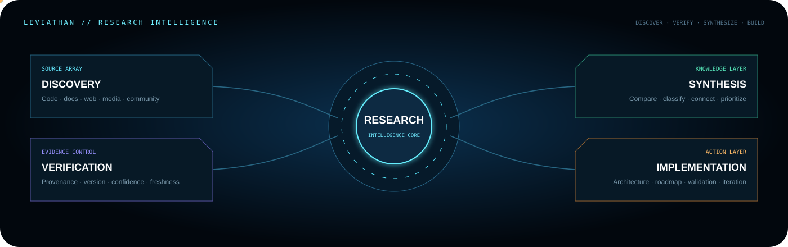
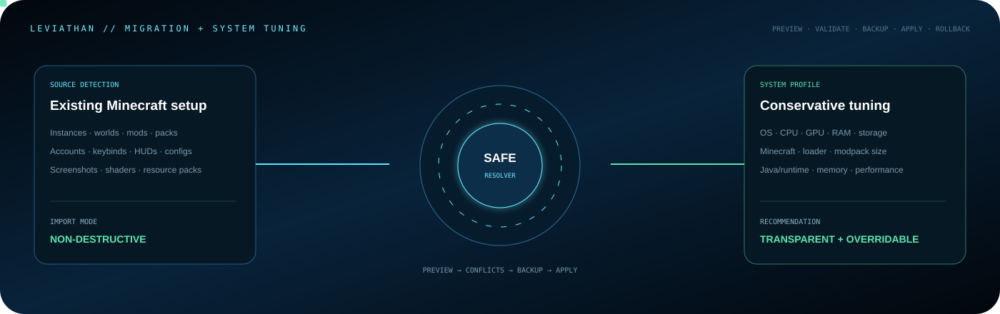

<picture>
  <source media="(prefers-color-scheme: dark)" srcset="./assets/hero-dark-v4.svg">
  <source media="(prefers-color-scheme: light)" srcset="./assets/hero-light-v4.svg">
  
</picture>

 

<strong>Founder of Leviathan and Nimbus</strong> 
Building Minecraft software, security systems, APIs, developer tooling and connected gaming platforms.

  

## Leviathan Command Core

Internal baseline <strong>v51.0.6</strong> · stabilization + validation · no public launcher or installer release

## Leviathan Neural Core

Sanitized public architecture. Proprietary implementation, credentials and private topology remain private.

## Research Intelligence

Research feeds product decisions through source discovery, evidence verification, synthesis and implementation.

## Migration & System Tuning

Safe migration uses previews, conflict handling, backups and rollback. Hardware detection produces conservative, transparent and user-overridable recommendations.

## Identity & External Services

Microsoft, Xbox and Minecraft services remain external trust boundaries. Leviathan owns only its own platform state.

## Leviathan Data Platform

High-level public data-platform view. Schemas, hosts, credentials and sensitive topology remain private.

## Development Roadmap

Current phase: stabilization and validation. The public release gate remains closed.

## Product & Platform Map

Leviathan player software and Nimbus server protection are separate product lines connected by shared platform, data and security principles.

## Development Stack

High-level technologies only. Proprietary implementation remains private.

## Experience & Commerce

Player experiences and commerce/entitlement flows remain separated, with payment credentials handled by the payment provider.

## Public Developer Network

<a href="https://github.com/Lapinite/Leviathan-Launcher"><strong>Launcher</strong></a> ·
<a href="https://github.com/Lapinite/Leviathan-Docs"><strong>Docs</strong></a> ·
<a href="https://github.com/Lapinite/Leviathan-API-Docs"><strong>API Docs</strong></a> ·
<a href="https://github.com/Lapinite/Leviathan-SDK"><strong>SDK</strong></a> ·
<a href="https://github.com/Lapinite/Leviathan-Integrations"><strong>Integrations</strong></a> ·
<a href="https://github.com/Lapinite/Leviathan-Examples"><strong>Examples</strong></a> ·
<a href="https://github.com/Lapinite/Leviathan-Server-Tools"><strong>Server Tools</strong></a> ·
<a href="https://github.com/Lapinite/Leviathan-Status"><strong>Status</strong></a> ·
<a href="https://github.com/Lapinite/Leviathan-Research-Pipeline"><strong>Research</strong></a>

## Live Development Telemetry

<h3 align="center">Account Overview</h3>
<!-- PROFILE_SUMMARY_START -->

<!-- PROFILE_SUMMARY_END -->
<!-- REPOSITORY_AGGREGATES_START -->
<!-- REPOSITORY_AGGREGATES_END -->

<h3 align="center">Public Commit Activity</h3>

<h3 align="center">Recent Public Activity</h3>
<!-- RECENT_ACTIVITY_START -->

<!-- RECENT_ACTIVITY_END -->

<h3 align="center">Repository Health</h3>
<!-- REPOSITORY_FRESHNESS_START -->

<!-- REPOSITORY_FRESHNESS_END -->

<!-- PUBLIC_ANALYTICS_START -->
<h3 align="center">Development Analytics</h3>

<!-- PUBLIC_ANALYTICS_END -->

<h3 align="center">Leviathan Launcher</h3>

## Contribution Activity

## Connect

<a href="https://www.spigotmc.org/members/leviathanclient.2607111/">SpigotMC</a> ·
<a href="https://github.com/Lapinite/Leviathan-Launcher/blob/main/SECURITY.md">Security</a> ·
<a href="https://github.com/Lapinite/Leviathan-Launcher/blob/main/SUPPORT.md">Support</a> ·
<a href="https://github.com/Lapinite/Leviathan-Launcher/blob/main/LEGAL.md">Legal</a>

NOT AN OFFICIAL MINECRAFT PRODUCT. NOT APPROVED BY OR ASSOCIATED WITH MOJANG OR MICROSOFT. 
© 2026 Leviathan project owner. All Rights Reserved.

