

<picture>
  <source media="(prefers-color-scheme: dark)" srcset="./assets/hero-dark-v3.svg">
  <source media="(prefers-color-scheme: light)" srcset="./assets/hero-light-v3.svg">
  
</picture>

 

<strong>Founder of Leviathan and Nimbus</strong>

 

Building Minecraft software, security systems, APIs, developer tooling and connected gaming platforms.

  

## Leviathan Command Core

  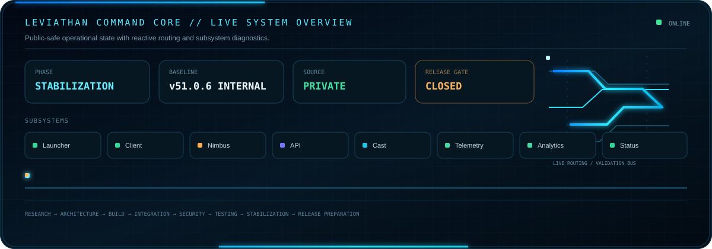

Internal baseline <strong>v51.0.6</strong> • stabilization + validation • no public launcher or installer release

## Leviathan Neural Core

  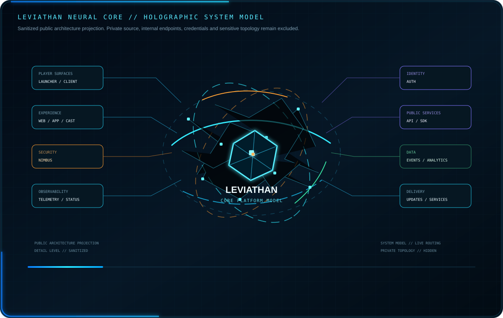

Sanitized public architecture view. Proprietary implementation and private topology remain private.

## Identity & External Services

  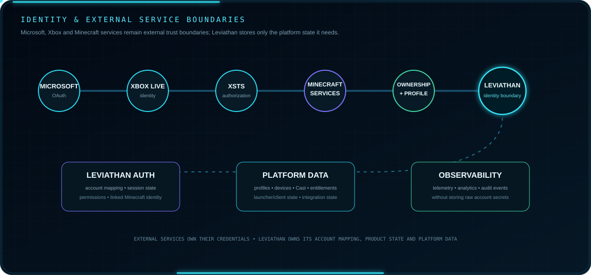

External identity and game-service trust boundaries remain outside Leviathan ownership.

## Leviathan Data Platform

  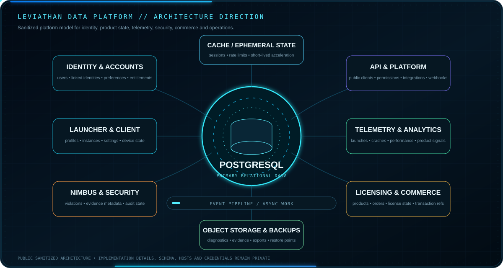

High-level public data-platform view. Schemas, hosts, credentials and sensitive topology remain private.

## Development Roadmap

  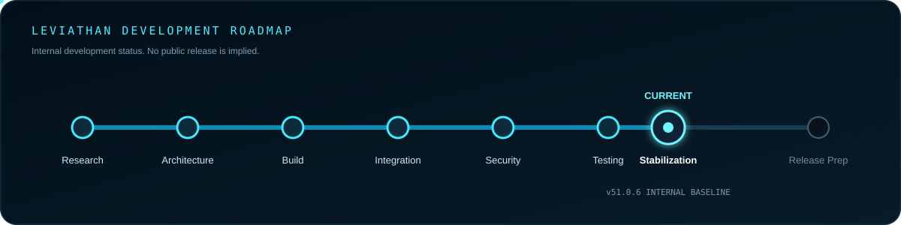

Current phase: stabilization and validation. The public release gate remains closed.

## Core Products

  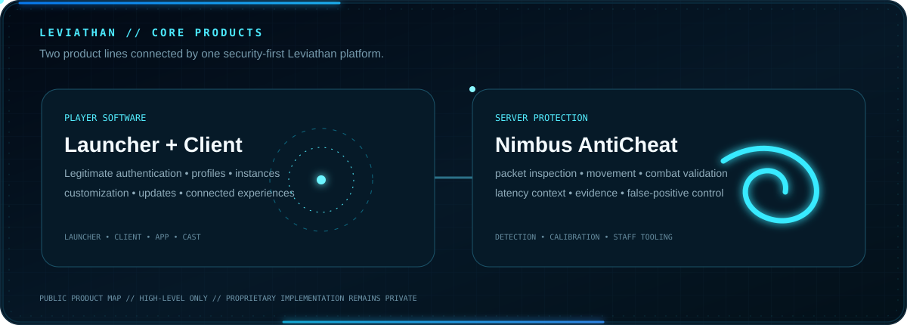

Leviathan player software and Nimbus server protection are separate product lines connected by shared platform and security principles.

## Current Leviathan Development Stack

  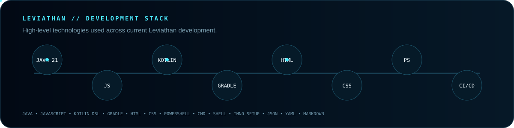

High-level technology names only. Proprietary implementation remains private.

## Leviathan Ecosystem

  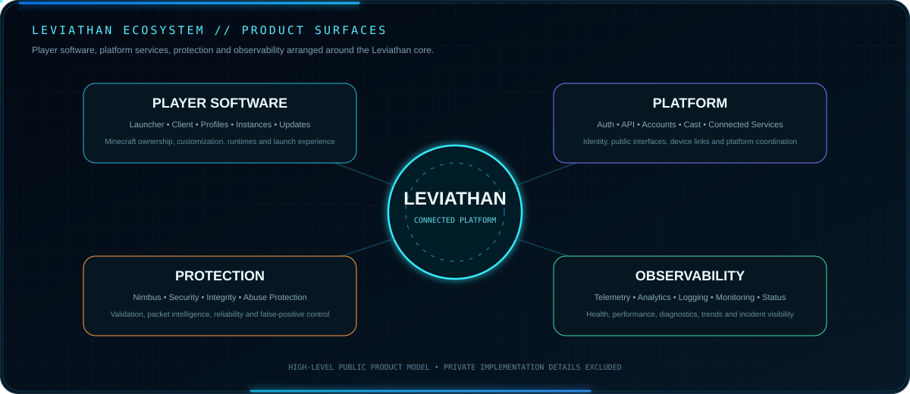

## Platform Areas

  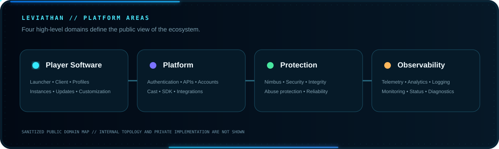

Player software, platform services, protection and observability shown as a deliberately simplified public domain map.

## Experience & Commerce Flows

  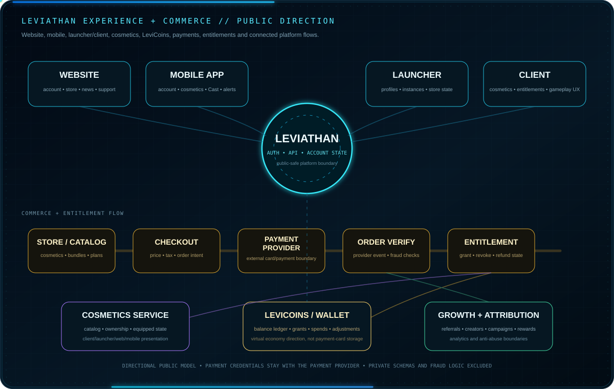

Player experiences and commerce/entitlement flows remain separated, with payment credentials handled by the payment provider.

## Public Developer Repositories

  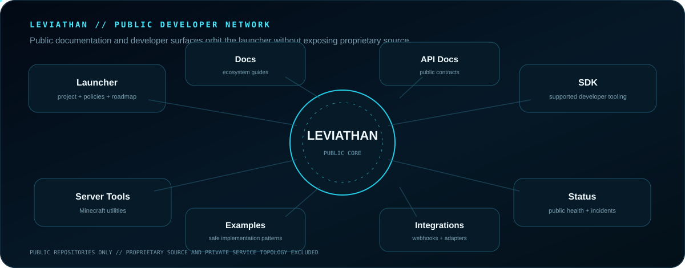

<a href="https://github.com/Lapinite/Leviathan-Launcher"><strong>Launcher</strong></a> ·
<a href="https://github.com/Lapinite/Leviathan-Docs"><strong>Docs</strong></a> ·
<a href="https://github.com/Lapinite/Leviathan-API-Docs"><strong>API Docs</strong></a> ·
<a href="https://github.com/Lapinite/Leviathan-SDK"><strong>SDK</strong></a> ·
<a href="https://github.com/Lapinite/Leviathan-Integrations"><strong>Integrations</strong></a> ·
<a href="https://github.com/Lapinite/Leviathan-Examples"><strong>Examples</strong></a> ·
<a href="https://github.com/Lapinite/Leviathan-Server-Tools"><strong>Server Tools</strong></a> ·
<a href="https://github.com/Lapinite/Leviathan-Status"><strong>Status</strong></a>

## Leviathan Development Activity

<h3 align="center">Live Account Overview</h3>

<!-- PROFILE_SUMMARY_START -->

  
  
  
  

<!-- PROFILE_SUMMARY_END -->

<!-- REPOSITORY_AGGREGATES_START -->

  

<!-- REPOSITORY_AGGREGATES_END -->

<h3 align="center">Public Commit Activity in the Last Year</h3>

  

<h3 align="center">Live Public Activity</h3>

<!-- RECENT_ACTIVITY_START -->

  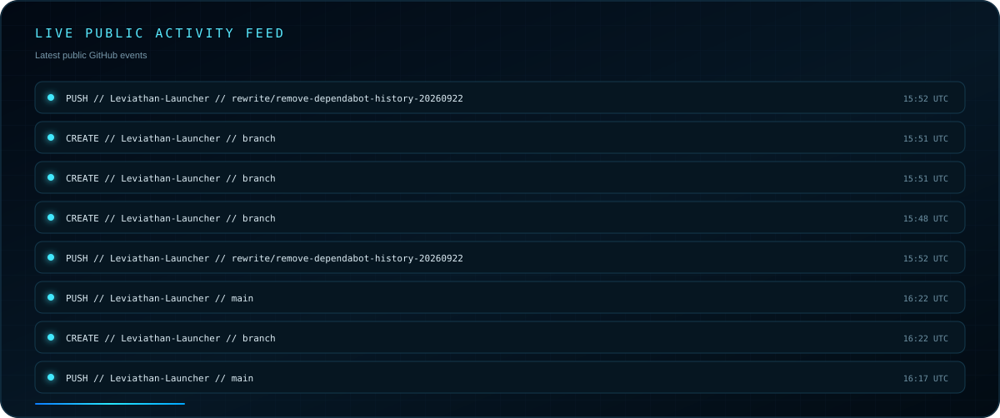

<!-- RECENT_ACTIVITY_END -->

<h3 align="center">Public Repository Health</h3>

<!-- REPOSITORY_FRESHNESS_START -->

  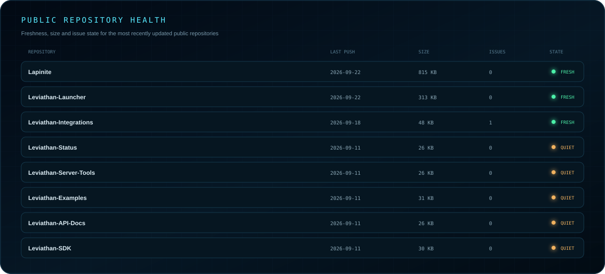

<!-- REPOSITORY_FRESHNESS_END -->

<!-- PUBLIC_ANALYTICS_START -->
<h3 align="center">Public Development Analytics</h3>

  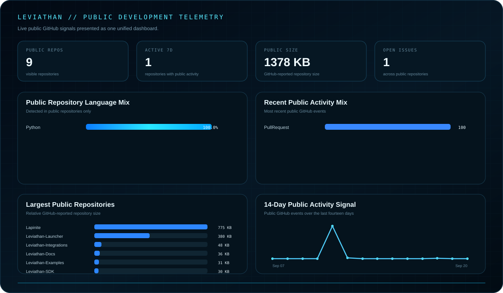

<!-- PUBLIC_ANALYTICS_END -->

<h3 align="center">Leviathan Launcher</h3>

  
  
  
  

## Contribution Activity

  

## Developer Resources

<a href="https://github.com/Lapinite/Leviathan-Docs"><strong>Documentation</strong></a> ·
<a href="https://github.com/Lapinite/Leviathan-API-Docs"><strong>API Reference</strong></a> ·
<a href="https://github.com/Lapinite/Leviathan-SDK"><strong>SDK</strong></a> ·
<a href="https://github.com/Lapinite/Leviathan-Examples"><strong>Examples</strong></a> ·
<a href="https://github.com/Lapinite/Leviathan-Integrations"><strong>Integrations</strong></a> ·
<a href="https://github.com/Lapinite/Leviathan-Status"><strong>Status</strong></a>

## Connect

<a href="https://www.spigotmc.org/members/leviathanclient.2607111/">SpigotMC</a> ·
<a href="https://github.com/Lapinite/Leviathan-Launcher/blob/main/SECURITY.md">Security</a> ·
<a href="https://github.com/Lapinite/Leviathan-Launcher/blob/main/SUPPORT.md">Support</a> ·
<a href="https://github.com/Lapinite/Leviathan-Launcher/blob/main/LEGAL.md">Legal</a>

NOT AN OFFICIAL MINECRAFT PRODUCT. NOT APPROVED BY OR ASSOCIATED WITH MOJANG OR MICROSOFT.

 

© 2026 Leviathan project owner. All Rights Reserved.

